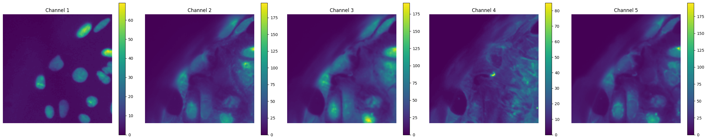

# TIFF Image Processing and Analysis Pipeline

A Python library for processing multi-channel TIFF images, creating tiles, and generating embeddings using a VAE model.

## Project Structure

### Core Files
- `main.py` - Main entry point that orchestrates the image processing pipeline:
  - Processes TIFF files from input directory
  - Creates tiles from composite images
  - Generates embeddings using VAE model

### Source Code directory (`src/`)

#### Image Processing (`src/process_images/`)
- `preprocess.py` - Handles TIFF file preprocessing:
  - Loads multi-channel TIFF images
  - Normalizes and resizes images
  - Creates composite arrays
- `create_tiles.py` - Creates fixed-size tiles from processed images:
  - Generates 128x128 pixel tiles
  - Saves tiles as parquet files

#### Deep Learning (`src/generate/`)
- `generate.py` - Handles VAE model inference:
  - Loads pretrained VAE model
  - Generates embeddings from image tiles
- `weights/model.py` - VAE model architecture definition

#### Data Loading (`src/load_dataset/`)
- `dataset.py` - PyTorch dataset implementation for tile loading

## Usage

Basic usage to process images and generate embeddings:
- Download model from hugging face using this command :
  ```
   git clone https://huggingface.co/temsis/Cell-Painting-VAE
  ```
```bash
python main.py -d sample_images
```

The pipeline will:
1. Load and process TIFF files from the input directory
2. Create tiles in the `tiles_output` directory
3. Generate embeddings using the VAE model

## Output
- Processed tiles are saved in `tiles_output/`
- Generated embeddings are saved as numpy arrays
- Processing logs are written to `log_error.log`


